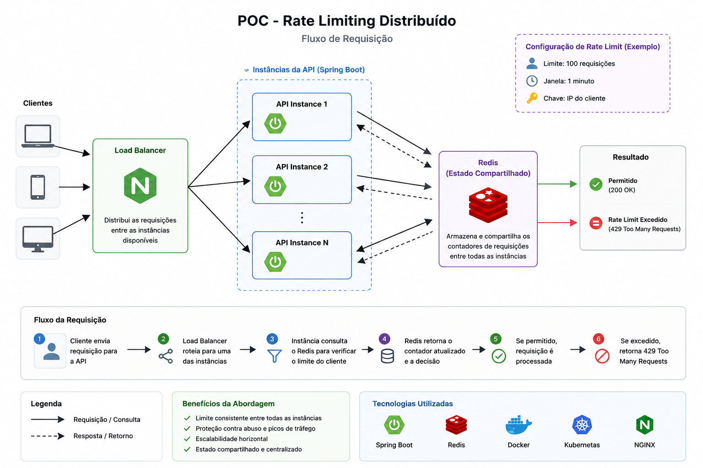

# ratelimit-poc

POC de rate limiting distribuido para APIs Spring Boot em ambiente escalavel.



O projeto demonstra como aplicar um limite global de requisicoes mesmo quando o trafego e distribuido entre multiplas instancias da aplicacao. O estado do rate limit fica centralizado no Redis, evitando contadores isolados por instancia.

## Sumario

- [Visao geral](#visao-geral)
- [Arquitetura](#arquitetura)
- [Stack](#stack)
- [Contrato HTTP](#contrato-http)
- [Configuracao](#configuracao)
- [Como executar](#como-executar)
- [Validacao manual](#validacao-manual)
- [Testes](#testes)
- [Kubernetes local](#kubernetes-local)
- [Documentacao do projeto](#documentacao-do-projeto)

## Visao geral

O endpoint protegido permite ate `10` requisicoes por cliente em uma janela fixa de `60` segundos. A partir da proxima chamada dentro da mesma janela, a API retorna `429 Too Many Requests`.

O cliente e identificado nesta ordem:

1. Header `X-Client-Id`, quando informado.
2. IP remoto da requisicao, quando o header nao existir.

Endpoints disponiveis:

| Metodo | Rota | Rate limit | Descricao |
| --- | --- | --- | --- |
| `GET` | `/api/protected` | Sim | Endpoint protegido para demonstracao |
| `GET` | `/actuator/health` | Nao | Health check da aplicacao |

## Arquitetura

```text
Cliente HTTP
    |
    v
Nginx / Kubernetes Service
    |
    +--> Spring Boot instance 1 --+
    |                             |
    +--> Spring Boot instance 2 --+--> Redis
    |                             |
    +--> Spring Boot instance N --+
```

Fluxo do rate limit:

1. A requisicao chega a uma instancia Spring Boot.
2. O filtro identifica o cliente.
3. A aplicacao monta uma chave Redis por cliente e rota.
4. Um script Lua incrementa o contador e define TTL de forma atomica.
5. A requisicao e liberada ou bloqueada conforme o limite configurado.

Chave Redis:

```text
rate-limit:{clientId}:{route}
```

Exemplo:

```text
rate-limit:client-a:/api/protected
```

## Stack

- Java 25
- Spring Boot 4.0.6
- Spring Web
- Spring Data Redis
- Spring Boot Actuator
- Redis
- Maven
- Docker e Docker Compose
- Nginx
- Kubernetes local
- JUnit e Testcontainers

## Contrato HTTP

### Requisicao permitida

```http
GET /api/protected HTTP/1.1
Host: localhost:8080
X-Client-Id: client-a
```

```http
HTTP/1.1 200 OK
X-RateLimit-Limit: 10
X-RateLimit-Remaining: 9
X-RateLimit-Reset: 60
```

```json
{
  "message": "Request accepted",
  "instance": "rate-limiter-api-1"
}
```

### Requisicao bloqueada

```http
HTTP/1.1 429 Too Many Requests
X-RateLimit-Limit: 10
X-RateLimit-Remaining: 0
X-RateLimit-Reset: 42
Retry-After: 42
```

```json
{
  "error": "rate_limit_exceeded",
  "message": "Too many requests. Try again later."
}
```

### Redis indisponivel

Se o Redis estiver indisponivel, o endpoint protegido falha fechado e retorna:

```http
HTTP/1.1 503 Service Unavailable
```

```json
{
  "error": "rate_limit_unavailable",
  "message": "Rate limit service is unavailable."
}
```

## Configuracao

| Variavel | Padrao | Descricao |
| --- | ---: | --- |
| `RATE_LIMIT_MAX_REQUESTS` | `10` | Maximo de requisicoes por janela |
| `RATE_LIMIT_WINDOW_SECONDS` | `60` | Duracao da janela em segundos |
| `SPRING_DATA_REDIS_HOST` | `localhost` | Host do Redis |
| `SPRING_DATA_REDIS_PORT` | `6379` | Porta do Redis |

## Como executar

### Opcao 1: Docker Compose

Esta e a forma recomendada para demonstrar o comportamento distribuido. O Compose sobe:

- Redis.
- Duas instancias da aplicacao.
- Nginx como load balancer.

```bash
docker compose up --build
```

A API ficara disponivel em:

```text
http://localhost:8080
```

### Opcao 2: Aplicacao local com Redis em Docker

Suba o Redis:

```bash
docker run --rm --name ratelimit-redis -p 6379:6379 redis:8-alpine
```

Em outro terminal, rode a aplicacao:

```bash
mvn spring-boot:run
```

Teste:

```bash
curl -i -H "X-Client-Id: client-a" http://localhost:8080/api/protected
```

## Validacao manual

### Exceder o limite

```bash
for i in {1..12}; do
  curl -i -H "X-Client-Id: client-a" http://localhost:8080/api/protected
done
```

Resultado esperado:

- Chamadas `1` a `10`: `200 OK`.
- Chamada `11` em diante, dentro da mesma janela: `429 Too Many Requests`.
- Respostas bloqueadas incluem `Retry-After`.

### Confirmar contadores independentes

```bash
curl -i -H "X-Client-Id: client-a" http://localhost:8080/api/protected
curl -i -H "X-Client-Id: client-b" http://localhost:8080/api/protected
```

Cada cliente possui seu proprio contador.

### Confirmar health check sem rate limit

```bash
curl -i http://localhost:8080/actuator/health
```

Esse endpoint nao consome limite e nao deve retornar `429`.

## Testes

```bash
mvn test
```

A suite cobre:

- Decisao de rate limit.
- Headers HTTP de sucesso e bloqueio.
- Resposta `429 Too Many Requests`.
- Resposta `503 Service Unavailable` quando o rate limiter falha.
- Bypass de rate limit no health check.
- Integracao Redis com Testcontainers, quando Docker esta disponivel para o ambiente de teste.

## Kubernetes local

Construa a imagem:

```bash
docker build -t ratelimit-poc:latest .
```

Se estiver usando Kind, carregue a imagem no cluster:

```bash
kind load docker-image ratelimit-poc:latest
```

Aplique os manifests:

```bash
kubectl apply -f k8s/redis.yaml
kubectl apply -f k8s/app-config.yaml
kubectl apply -f k8s/app-deployment.yaml
kubectl apply -f k8s/app-service.yaml
```

Abra acesso local:

```bash
kubectl port-forward service/ratelimiter-api 8080:8080
```

Valide pelo endpoint protegido:

```bash
for i in {1..12}; do
  curl -i -H "X-Client-Id: client-a" http://localhost:8080/api/protected
done
```

## Estrutura do projeto

```text
.
|-- docs/
|-- k8s/
|-- nginx/
|-- src/
|   |-- main/
|   |   |-- java/com/example/ratelimiter/
|   |   `-- resources/application.yml
|   `-- test/
|-- Dockerfile
|-- docker-compose.yml
|-- pom.xml
`-- README.md
```

Pacotes principais:

| Pacote | Responsabilidade |
| --- | --- |
| `config` | Propriedades e configuracao Redis |
| `ratelimit` | Regra, decisao e integracao com Redis |
| `web` | Filtro HTTP e controller protegido |

## Documentacao do projeto

O projeto foi iniciado a partir de documentos de especificacao:

- [Visao e escopo](docs/01-visao-e-escopo.md)
- [Requisitos](docs/02-requisitos.md)
- [Especificacao funcional](docs/03-especificacao-funcional.md)
- [Arquitetura proposta](docs/04-arquitetura.md)
- [Criterios de aceite e testes](docs/05-criterios-de-aceite.md)
- [Plano de implementacao](docs/06-plano-de-implementacao.md)
