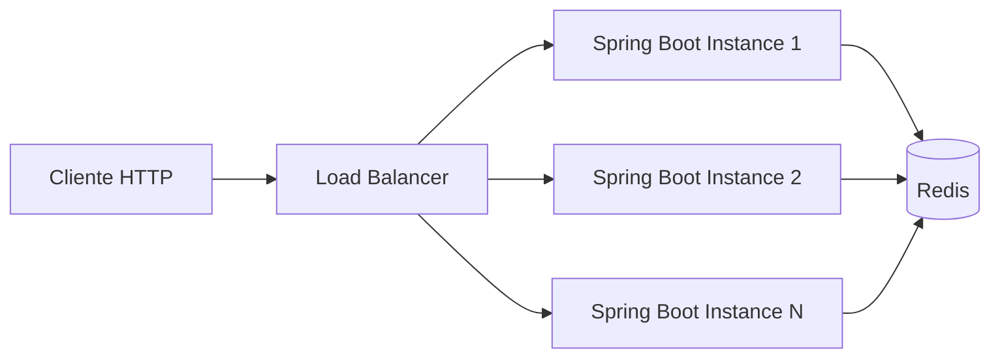

# Arquitetura Proposta

## Componentes



## Responsabilidades

### Load Balancer

Distribui requisicoes entre multiplas instancias da aplicacao.

No ambiente local, pode ser representado por:

- Kubernetes Service.
- Ingress Controller.
- Nginx em Docker Compose.

### Aplicacao Spring Boot

Responsavel por:

- Receber requisicoes HTTP.
- Identificar cliente.
- Consultar Redis para decidir se a chamada sera permitida.
- Retornar headers de rate limit.
- Expor endpoints de exemplo.

### Redis

Responsavel por:

- Armazenar contadores temporarios.
- Expirar chaves ao fim da janela.
- Executar incremento atomico com TTL.

## Modulos sugeridos

```text
com.example.ratelimiter
  config
    RateLimitProperties
    RedisConfig
  ratelimit
    RateLimitDecision
    RateLimitService
    RedisRateLimitService
  web
    RateLimitFilter
    ProtectedController
```

## Algoritmo inicial

Janela fixa com Redis.

Operacao atomica sugerida em Lua:

```lua
local current = redis.call('INCR', KEYS[1])
if current == 1 then
  redis.call('EXPIRE', KEYS[1], ARGV[1])
end
local ttl = redis.call('TTL', KEYS[1])
return { current, ttl }
```

Comportamento:

- Primeira requisicao cria a chave e define TTL.
- Requisicoes seguintes incrementam o contador.
- Quando a chave expira, uma nova janela comeca.

## Estrategia de execucao local

### Fase 1: Spring Boot + Redis local

Rodar Redis via Docker e a aplicacao via Maven.

Objetivo:

- Validar regra de rate limiting com uma instancia.

### Fase 2: Docker Compose com Load Balancer

Rodar:

- Redis.
- Duas replicas da aplicacao.
- Nginx distribuindo chamadas.

Objetivo:

- Demonstrar que o limite e compartilhado entre instancias.

### Fase 3: Kubernetes local

Rodar:

- Deployment da aplicacao com replicas.
- Deployment ou StatefulSet simples do Redis.
- Services para aplicacao e Redis.

Objetivo:

- Simular ambiente escalavel com replicas atras de Service Kubernetes.

## Decisoes iniciais

### ADR-000: Stack base

A aplicacao sera implementada com Java 25 e Spring Boot 4.0.6. A configuracao de build, imagem Docker e manifests devem refletir essas versoes.

### ADR-001: Redis como fonte compartilhada

Redis sera usado porque oferece baixa latencia, TTL nativo e operacoes atomicas adequadas para rate limiting distribuido.

### ADR-002: Janela fixa na primeira versao

Janela fixa e simples de entender, implementar e testar. Algoritmos mais refinados podem ser considerados depois.

### ADR-003: Falhar fechado quando Redis estiver indisponivel

Para uma API protegida, indisponibilidade do rate limiter deve bloquear o endpoint protegido com `503`, evitando liberar trafego ilimitado acidentalmente.
